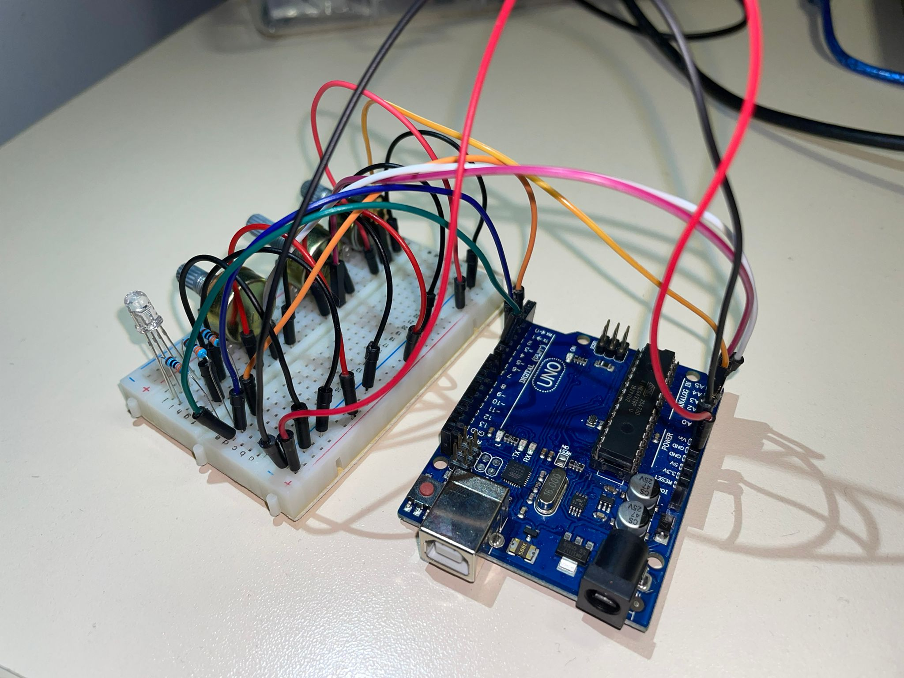
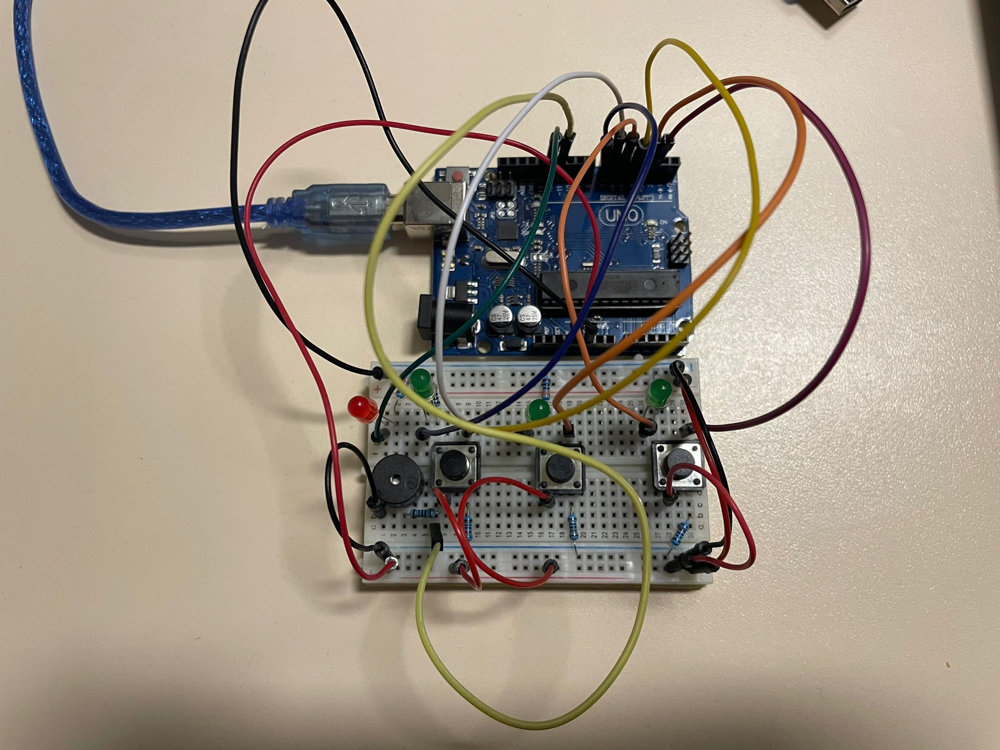
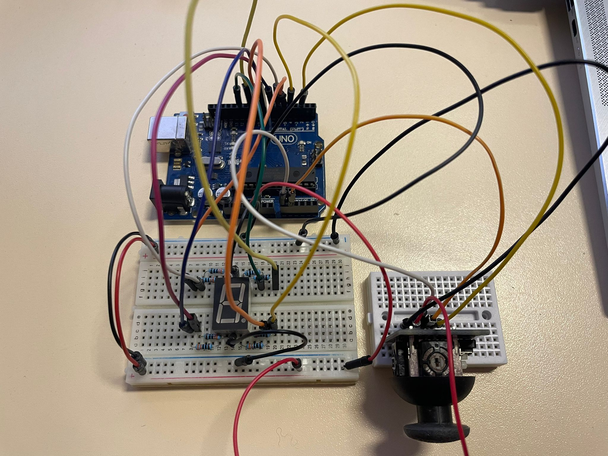
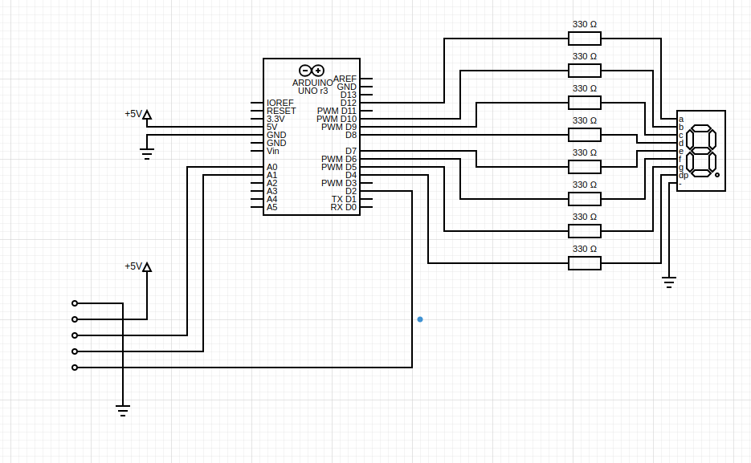
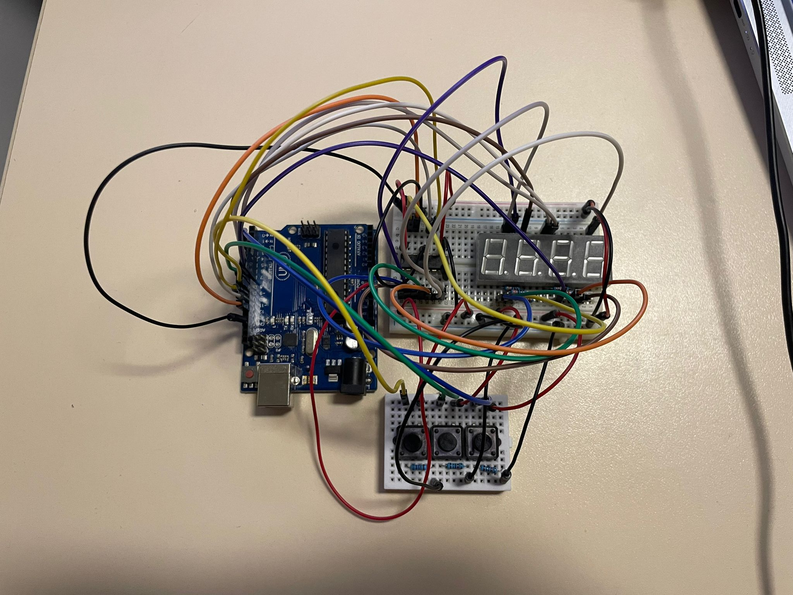
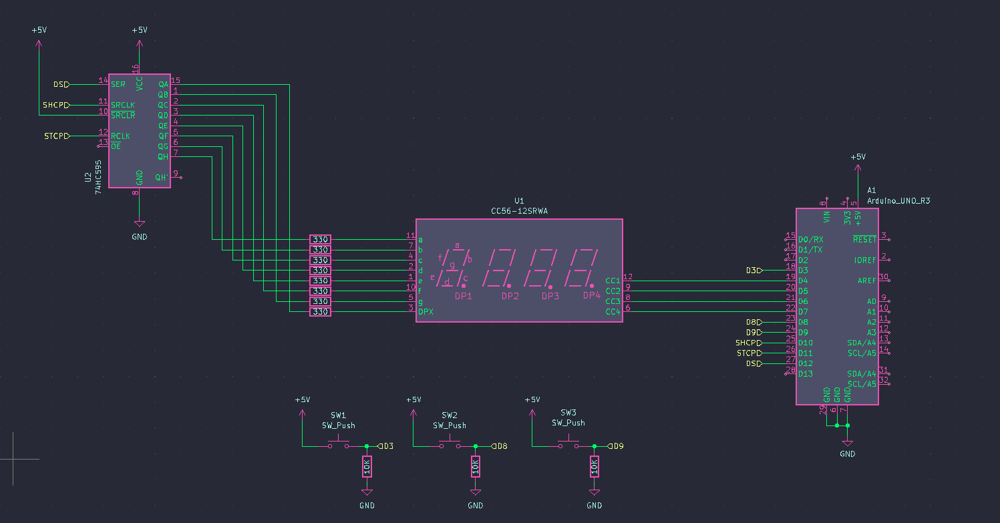
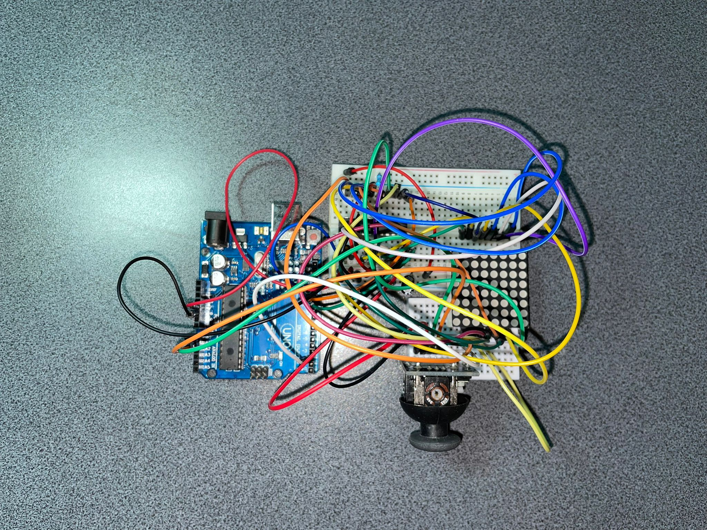

# IntroductionToRobotics

Hey there! This is my personal repository for "Introduction to Robotics" class assignments. It's where I organize, submit, and track my homework. Feel free to look around and follow my academic path in robotics as it unfolds.

## Homeworks

Homework no.2

    
### Description
This homework is focused on gaining experience with potentiometers, Arduino, and RGB LEDs. You should learn how to control each RGB color (Red, Green, and Blue) individually using three potentiometers.

### Tasks Requirement
* **Potentiometer Control:** Use separate potentiometers for Red, Green, and Blue to control the RGB LED colors.
* **Digital Electronics:** Learn how to use Arduino to read the potentiometer values.
* **Color Mapping:** After reading the potentiometer values, map and send these values to the LED pins to achieve precise color control.

The main code is presented [here](https://github.com/Anca-Sorana/IntroductionToRobotics/blob/main/Homework2/code_hm_2/code_hm_2.ino).

Here you can have a qiuck look at the setup I have:

    

And here you have a short [demo](https://youtu.be/HEL5YOT_iao) of how everything works.

Homework no.3

    
### Description
This assignment involves simulating a 3-floor elevator control system using LEDs, buttons, and a buzzer with Arduino. By the end of this task, you will gain experience in using button state change, implementing debouncing techniques, and coordinating multiple components to represent real-world scenarios.

### Tasks Requirements
* **LED Indication:** Use 3 LEDs, where each LED stands for one of the 3 floors. The LED corresponding to the elevator's current floor should be illuminated. Have an additional LED that shows the elevator's operational status. This LED should blink when the elevator is in motion and remain steady when the elevator is at rest.
* **Button Integration:** Incorporate 3 buttons to symbolize the call buttons for each floor. On pressing a button, the elevator should mimic its movement towards the respective floor after a brief delay of 2-3 seconds.
* **Buzzer Notification** The buzzer should emit a brief sound during the following situations:
    * When the elevator reaches the selected floor, emitting a sound resembling a "cling".
    * During elevator door closures and movements (consider differentiating the two scenarios with distinct sounds).
* **State Management & Timers:** If the elevator is already stationed at the chosen floor, pressing the button designated for that floor should not trigger any actions. Upon a button press, the elevator should "pause for the doors to close" and subsequently "move" to the selected floor. If the elevator is already moving when another floor button is pressed, it should either continue its current course or queue its next action (i.e., once it arrives at the first selected floor, it opens the doors, waits, closes them, and then heads to the next chosen floor).
* **Debounce Implementation:** It's crucial to integrate debounce techniques for the buttons. This will help in preventing unintended repeated activations due to button bounce.

The main code is presented [here](https://github.com/Anca-Sorana/IntroductionToRobotics/blob/main/Homework3/code_hm_3/code_hm_3.ino).

Here you can have a qiuck look at the setup I have:

    
    

And here you have a short [demo](https://youtu.be/dt2dZcCphvs) of how everything works.

Homework no.4

    
### Description
Develop an interactive interface where users employ a joystick to 'draw' on a display, ensuring intuitive movements between segments, which allow transitions only to adjacent positions without crossing designated 'walls'.

### Tasks Requirement
* **Initial Positioning:** The starting position must be at the DP (Decimal Point).
* **Blinking Indicator:** Regardless of a segment's status (ON or OFF), the current position should always blink.
* **Joystick Movement Mapping:** Use the joystick to navigate between positions. Reference the provided table for specific movement directions.
* **Toggle Segment State:** A short press on the button will switch the segment state between ON and OFF.
* **Display Reset:** A long press on the button will revert the entire display to its default state. This action turns all segments OFF and returns the current position to the decimal point.

The main code is presented [here](https://github.com/Anca-Sorana/IntroductionToRobotics/blob/main/Homework4/code_hm_4/code_hm_4.ino).

Here you can have a qiuck look at the setup I have:

    
    

And here you have a short [demo](https://youtu.be/mWI0-JqA_ME) of how everything works.

Homework no.5

    
### Description
This project is about implementing a stopwatch timer using a 4-digit 7-segment display and 3 buttons. The stopwatch will count in tenths of a second and feature a save lap functionality, similar to basic stopwatch functions found on most phones. The starting value of the display should be "000.0". Each button on the device will have distinct functionalities such as start/pause, reset, and save/cycle laps. 

### Task Requirements
* **Stopwatch Timer Implementation:** Create a stopwatch timer using a 4-digit 7-segment display and 3 buttons.
* **Starting Value:** The display should initially show "000.0".
* **Button Functionalities:**
  * Button 1: Start/pause the stopwatch.
  * Button 2:
    * Reset the timer when in pause mode.
    * Reset saved laps when in lap viewing mode.
  * Button 3:
    * Save lap times when the timer is counting (up to 4 laps).
    * Cycle through the last saved laps.
* **Workflow:**
  * The display starts at "000.0". Pressing the Start button begins the timer.
  * During the timer, pressing the lap button saves the current time in memory (up to 4 laps).
  * If the reset button is pressed while the timer is running, nothing happens.
  * In pause mode, the lap button is inactive. Pressing reset sets the display to "000.0".
  * After resetting, pressing the lap button cycles through saved lap times. Continuously pressing it cycles through them repeatedly.
  * Pressing reset in lap viewing mode clears all saved laps and resets the display to "000.0".
    
The main code is presented [here](https://github.com/Anca-Sorana/IntroductionToRobotics/blob/main/Homework5/code_hm_5/code_hm_5.ino).

Here you can have a qiuck look at the setup I have:

    
    

And here you have a short [demo](https://youtu.be/_mtUpsOnUPA) of how everything works.    

    
Homework no. 6

### Description
The Smart Environment Monitor and Logger is an Arduino-based system designed to collect and log environmental data. It integrates various sensors, EEPROM for data logging, and provides user interaction through an RGB LED and a Serial Menu. The project emphasizes on sensor integration, memory management, Serial Communication, and menu-driven user interaction.

### Task Requirements
* Sensor Data Collection: Utilizes multiple sensors to gather environmental data.
* Data Logging: Logs sensor data into EEPROM for later retrieval and analysis.
* Visual Feedback: Uses an RGB LED for visual alerts and status indications.
* Serial Menu Interface: Offers a user-friendly serial menu for system interaction and configuration.

#### Menu structure
* Sensor Settings
    * Sampling Interval: Set the interval (1-10 seconds) for sensor data sampling.
    * Ultrasonic Alert Threshold: Set a threshold for the ultrasonic sensor to trigger alerts.
    * LDR Alert Threshold: Set a threshold for the LDR sensor to trigger alerts.
    * Back: Return to the main menu.  

* Reset Logger Data
    * Yes: Confirm and delete all logged data.
    * No: Cancel and return to the main menu.

* System Status
    * Current Sensor Readings: View real-time sensor data.
    * Current Sensor Settings: Display current sensor configurations.
    * Display Logged Data: Show the last 10 sensor readings.
    * Back: Return to the main menu.

* RGB LED Control
    * Manual Color Control: Customize the RGB LED color.
    * LED Automatic Mode: Toggle between automatic and manual LED modes.
    * Back: Return to the main menu.

    
Homework no. 7

### Description
Matrix Maze is an engaging 8x8 matrix-based game designed to introduce you to the world of matrix projects. In this game, you navigate a player through a maze of walls, deploying bombs or bullets to clear your path. The game features a Bomberman-style or terminator-tanks gameplay with a twist of strategy and quick reflexes. It's a perfect blend of nostalgia and modern programming challenges.

#### Game Elements
* **Player:** Represented by a blinking LED, the player moves around the matrix to break walls and avoid bombs.
* **Bombs/Bullets:** These elements blink rapidly and are used by the player to destroy walls.
* **Walls:** Non-blinking elements that occupy 50% - 75% of the map, creating a maze for the player to navigate.

#### Game Objective:
Your goal is to navigate through the maze, strategically place bombs, and destroy all the walls without getting caught in the bomb's blast. A special animation signals the game's end if the player is caught in an explosion, after which the game restarts.

### Task Requirements:
* LED Differentiating:
    * The player's LED should blink slowly to distinguish it from other elements.
    * Bombs/Bullets should have a fast blinking rate.
    * Walls remain static (non-blinking).
* Control:
    * Implement smooth and responsive controls for an enjoyable gameplay experience.
    * You may choose any control mechanism (e.g., joystick) but focus on player comfort and ease of handling.
* Initial Setup:
    * Ensure walls are not generated on the player's starting position.
    * The initial setup should offer a fair chance for the player to strategize their first move.
* Game Logic:
    * Implement a mechanism where placing a bomb requires the player to move away to avoid the blast.
    * The game should restart with an animation if the player fails to escape the blast.
* Creativity:
    * Feel free to add your creative touch, whether it's in gameplay, additional elements, or visual effects.

The main code is presented [here](https://github.com/Anca-Sorana/IntroductionToRobotics/blob/main/Homework7/code_hm_7/code_hm_7.ino).

Here you can have a qiuck look at the setup I have:

    

And here you have a short [demo]() of how everything works. 

