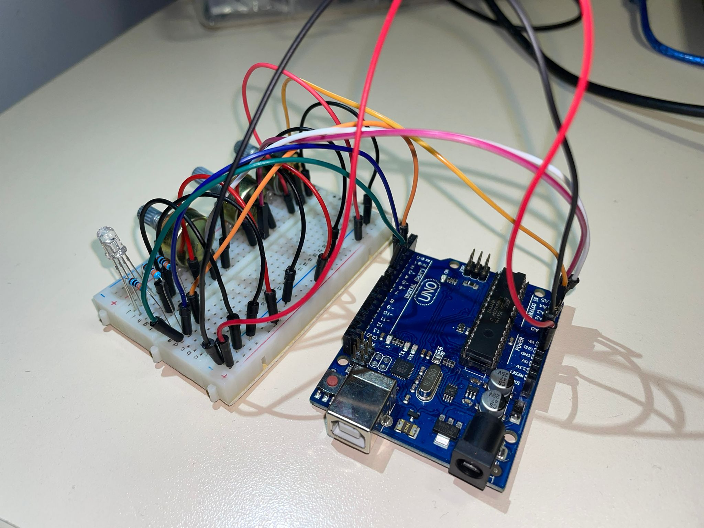
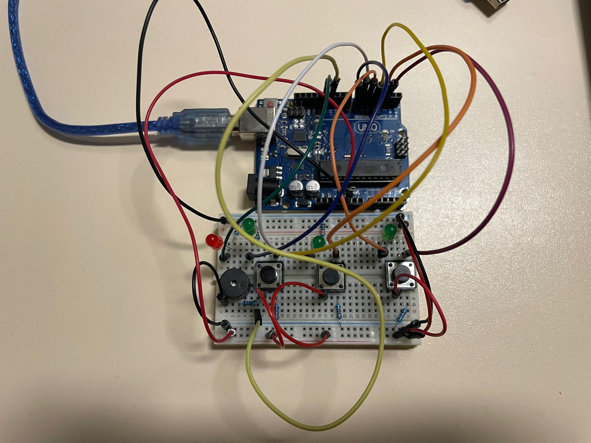
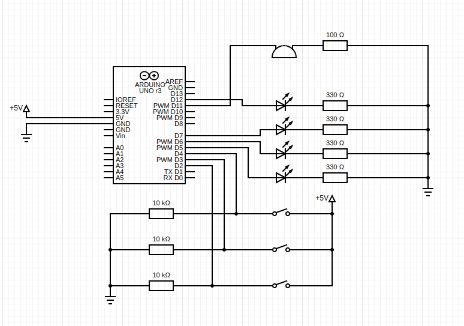
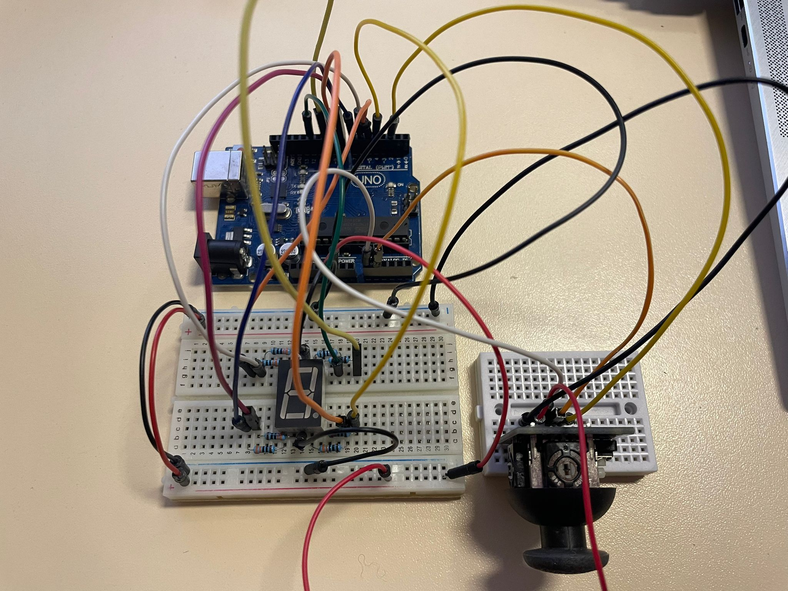
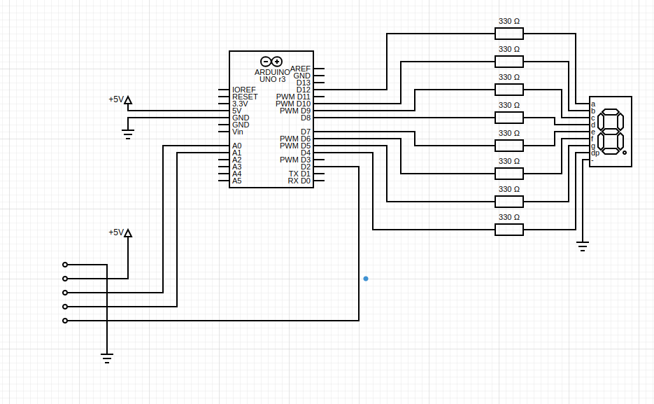
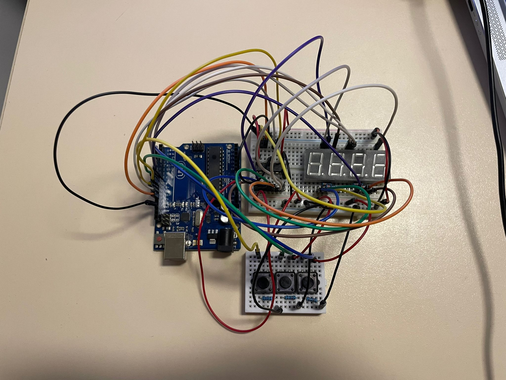
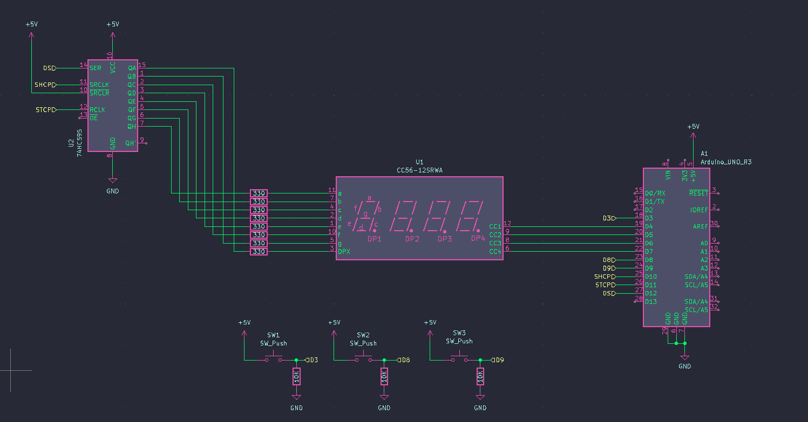

# IntroductionToRobotics

Hey there! This is my personal repository for "Introduction to Robotics" class assignments. It's where I organize, submit, and track my homework. Feel free to look around and follow my academic path in robotics as it unfolds.

## Homeworks

Homework no.2

    
### Description
This homework is focused on gaining experience with potentiometers, Arduino, and RGB LEDs. You should learn how to control each RGB color (Red, Green, and Blue) individually using three potentiometers.

### Tasks Requirement
* **Potentiometer Control:** Use separate potentiometers for Red, Green, and Blue to control the RGB LED colors.
* **Digital Electronics:** Learn how to use Arduino to read the potentiometer values.
* **Color Mapping:** After reading the potentiometer values, map and send these values to the LED pins to achieve precise color control.

The main code is presented [here](https://github.com/Anca-Sorana/IntroductionToRobotics/blob/main/Tema2/main_code/main_code.ino).

Here you can have a qiuck look at the setup I have:

    

And here you have a short [demo](https://youtu.be/HEL5YOT_iao) of how everything works.

Homework no.3

    
### Description
This assignment involves simulating a 3-floor elevator control system using LEDs, buttons, and a buzzer with Arduino. By the end of this task, you will gain experience in using button state change, implementing debouncing techniques, and coordinating multiple components to represent real-world scenarios.

### Tasks Requirements
* **LED Indication:** Use 3 LEDs, where each LED stands for one of the 3 floors. The LED corresponding to the elevator's current floor should be illuminated. Have an additional LED that shows the elevator's operational status. This LED should blink when the elevator is in motion and remain steady when the elevator is at rest.
* **Button Integration:** Incorporate 3 buttons to symbolize the call buttons for each floor. On pressing a button, the elevator should mimic its movement towards the respective floor after a brief delay of 2-3 seconds.
* **Buzzer Notification** The buzzer should emit a brief sound during the following situations:
    * When the elevator reaches the selected floor, emitting a sound resembling a "cling".
    * During elevator door closures and movements (consider differentiating the two scenarios with distinct sounds).
* **State Management & Timers:** If the elevator is already stationed at the chosen floor, pressing the button designated for that floor should not trigger any actions. Upon a button press, the elevator should "pause for the doors to close" and subsequently "move" to the selected floor. If the elevator is already moving when another floor button is pressed, it should either continue its current course or queue its next action (i.e., once it arrives at the first selected floor, it opens the doors, waits, closes them, and then heads to the next chosen floor).
* **Debounce Implementation:** It's crucial to integrate debounce techniques for the buttons. This will help in preventing unintended repeated activations due to button bounce.

The main code is presented [here](https://github.com/Anca-Sorana/IntroductionToRobotics/blob/main/Tema3/main/main.ino).

Here you can have a qiuck look at the setup I have:

    
    

And here you have a short [demo](https://youtu.be/dt2dZcCphvs) of how everything works.

Homework no.4

    
### Description
Develop an interactive interface where users employ a joystick to 'draw' on a display, ensuring intuitive movements between segments, which allow transitions only to adjacent positions without crossing designated 'walls'.

### Tasks Requirement
* **Initial Positioning:** The starting position must be at the DP (Decimal Point).
* **Blinking Indicator:** Regardless of a segment's status (ON or OFF), the current position should always blink.
* **Joystick Movement Mapping:** Use the joystick to navigate between positions. Reference the provided table for specific movement directions.
* **Toggle Segment State:** A short press on the button will switch the segment state between ON and OFF.
* **Display Reset:** A long press on the button will revert the entire display to its default state. This action turns all segments OFF and returns the current position to the decimal point.

The main code is presented [here](https://github.com/Anca-Sorana/IntroductionToRobotics/blob/main/Tema4/main/main.ino).

Here you can have a quick look at the setup that I have:

    
    

And here you have a short [demo](https://youtu.be/mWI0-JqA_ME) of how everything works.

Homework no.5

    
### Description
This project is about implementing a stopwatch timer using a 4-digit 7-segment display and 3 buttons. The stopwatch will count in tenths of a second and feature a save lap functionality, similar to basic stopwatch functions found on most phones. The starting value of the display should be "000.0". Each button on the device will have distinct functionalities such as start/pause, reset, and save/cycle laps. 

### Task Requirements
* **Stopwatch Timer Implementation:** Create a stopwatch timer using a 4-digit 7-segment display and 3 buttons.
* **Starting Value:** The display should initially show "000.0".
* **Button Functionalities:**
  * Button 1: Start/pause the stopwatch.
  * Button 2:
    * Reset the timer when in pause mode.
    * Reset saved laps when in lap viewing mode.
  * Button 3:
    * Save lap times when the timer is counting (up to 4 laps).
    * Cycle through the last saved laps.
* **Workflow:**
  * The display starts at "000.0". Pressing the Start button begins the timer.
  * During the timer, pressing the lap button saves the current time in memory (up to 4 laps).
  * If the reset button is pressed while the timer is running, nothing happens.
  * In pause mode, the lap button is inactive. Pressing reset sets the display to "000.0".
  * After resetting, pressing the lap button cycles through saved lap times. Continuously pressing it cycles through them repeatedly.
  * Pressing reset in lap viewing mode clears all saved laps and resets the display to "000.0".
    
The main code is presented [here](https://github.com/Anca-Sorana/IntroductionToRobotics/blob/main/Tema5/tema5/tema5.ino).

Here you can have a quick look at the setup that I have:

    
    

And here you have a short [demo](https://youtu.be/_mtUpsOnUPA) of how everything works.    

